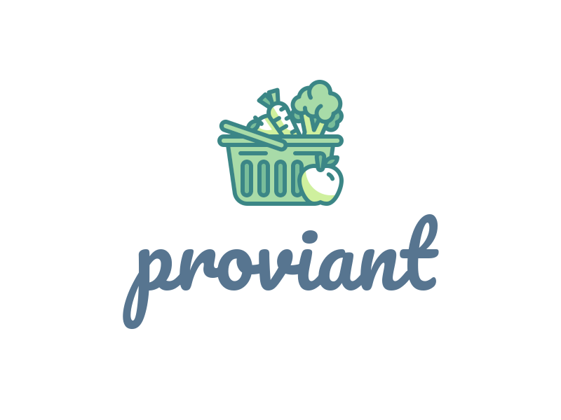
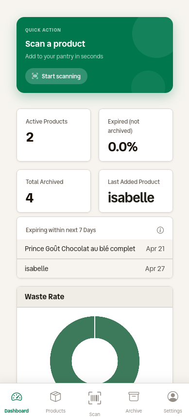
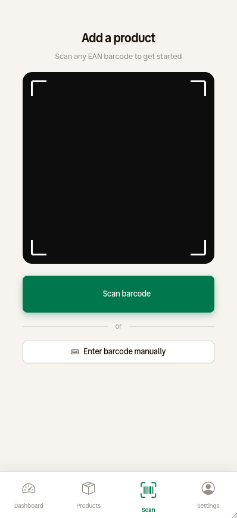
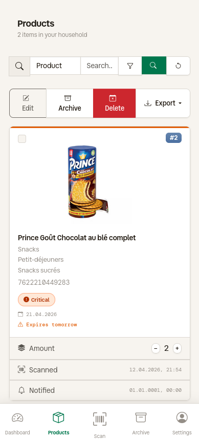
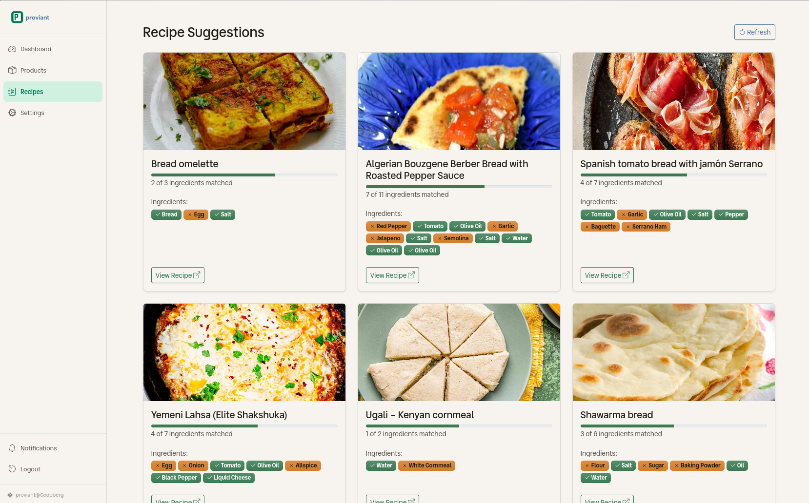
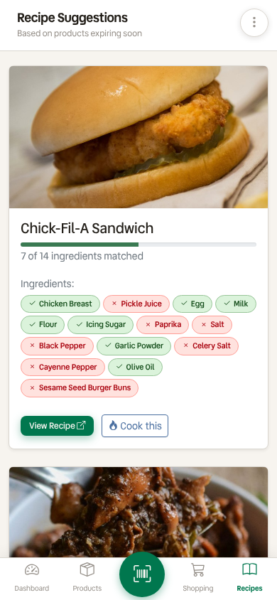

[](https://sonarcloud.io/summary/new_code?id=Isotop7_proviant)
[](https://sonarcloud.io/summary/new_code?id=Isotop7_proviant)
[](https://sonarcloud.io/summary/new_code?id=Isotop7_proviant)

⁉️ Ever wondered if this oat milk is still fresh or when you opened that hummus? In the past you may have thrown it away. Now there is **proviant**

📚 **proviant** is a simple and intuitive application to track your bought products and their expiration date to prevent waste of food 🥗

## Preview

**Dashboard** — metric tiles, waste rate donut, category breakdown and expiry trend charts


**Products** — search, filter and manage your products


## Features

- 📝 Track and log products with expiration dates.
- 📷 Scan product barcodes via camera to auto-fill data from [OpenFoodFacts](https://world.openfoodfacts.org/), with optional local caching for offline use.
- 📸 **OCR expiry date scanning** — use your camera to capture and extract expiry dates (Tesseract/Google/OpenAI).
- 🗄️ **Archive and restore products** — view archived products separately; bulk archive, restore, or delete.
- 🔍 **Advanced filtering** — filter by status (All, Expired, Critical, Expiring soon, Fresh, No date, Archived), storage location, or search by product name/barcode.
- 📊 **Dashboard** — live metric tiles (active products, waste rate, archived counts, last added product, products expiring within 7 days) and charts (waste rate donut, category breakdown pie, 12-month expiry trend line).
- ⏰ Expiration reminders via email (SMTP), push notifications ([Ntfy](https://ntfy.sh/)), or [Telegram](https://telegram.org/) bot.
- 🔔 Per-user notification preferences.
- 👥 Multi-user support with household scoping.
- 🌙 Dark theme.
- 📥 **Export** — download products and archive data as CSV or JSON.
- 🍽️ **Recipe suggestions** — get recipe ideas based on your products (TheMealDB / Spoonacular).

## Quick Start

```bash
curl -o docker-compose.yml https://codeberg.org/isotop7/proviant/raw/branch/main/docker-compose.sqlite.yaml
docker compose up -d
```

Then open http://localhost:5114

## Technologies and Tools

- **Web:** [Go](https://go.dev/), [Gin](https://gin-gonic.com/), [Gorm](https://gorm.io/index.html), [Bootstrap](https://getbootstrap.com/)
- **Charts:** [Chart.js](https://www.chartjs.org/)
- **Database:** MariaDB or SQLite
- **Notifications:** SMTP, [Ntfy](https://ntfy.sh/), [Telegram](https://telegram.org/)

## Installation and Usage

### Backend

#### Executable

1. Clone the repository: `git clone https://codeberg.org/isotop7/proviant.git`
2. Setup node_modules and assets: `task init`
3. Navigate to the project directory: `cd proviant/src`
4. Build the application: `go build -o proviant`
5. Copy the desired config file `config.yaml.[mariadb|sqlite].tmpl`, rename it to `config.yaml` and adjust it
6. Run the server: `./proviant`

#### Docker

`proviant` can be started with `docker compose`

- [External MariaDB database](./docker-compose.mariadb.yaml)
- [Internal SQLite database](./docker-compose.sqlite.yaml)

**IMPORTANT:** The mounted directories need to be chowned by the proviant app user.

```bash
chown -R 100:101 <path>
```

### Configuration

Configuration is set via environment variables. The complete list of available options and their default values is below. Template configuration files are available in `src/config.yaml.sqlite.tmpl` and `src/config.yaml.mariadb.tmpl`.

#### Server

| Environment Variable | Default | Description |
|---|---|---|
| `PROVIANT_SERVER_PORT` | `5114` | Listening port |
| `PROVIANT_SERVER_BASEURL` | `https://proviant.local.de` | URL of Proviant with protocol (used in emails, notifications) |
| `PROVIANT_SERVER_AUTHENTICATION_TOKENPASSWORD` | `secret key` | Secret used for JSON Web Tokens |
| `PROVIANT_SERVER_AUTHENTICATION_TOKENLIFETIME` | `8` | Lifetime of JSON Web Tokens in hours |
| `PROVIANT_SERVER_AUTHENTICATION_MAXLOGINATTEMPTS` | `3` | Maximum failed login attempts before lockout |
| `PROVIANT_SERVER_AUTHENTICATION_LOCKOUTDURATIONMINS` | `10` | Lockout duration in minutes after max failed attempts |
| `PROVIANT_SERVER_AUTHENTICATION_PASSWORDMINLENGTH` | `12` | Minimum password length |
| `PROVIANT_SERVER_AUTHENTICATION_PASSWORDREQUIREUPPERCASE` | `false` | Require at least one uppercase letter |
| `PROVIANT_SERVER_AUTHENTICATION_PASSWORDREQUIREDIGIT` | `false` | Require at least one digit |
| `PROVIANT_SERVER_AUTHENTICATION_PASSWORDREQUIRESPECIAL` | `false` | Require at least one special character |
| `PROVIANT_SERVER_AUTHENTICATION_PASSWORDCHECKBREACHED` | `true` | Check passwords against HaveIBeenPwned API |
| `PROVIANT_SERVER_CORS_ALLOWALLORIGINS` | `false` | Allow all origins (`true`) or use `allowedOrigins` list (`false`) |
| `PROVIANT_SERVER_CORS_ALLOWEDORIGINS` | `http://localhost,http://myproviant.instance` | Comma-separated list of allowed origins when `allowAllOrigins` is `false` |
| `PROVIANT_SERVER_SECURITYHEADERS_CONTENT_SECURITY_POLICY` | `default-src 'self'; script-src 'self' 'unsafe-inline'; style-src 'self' 'unsafe-inline'; img-src 'self' data: https:;` | Content Security Policy header |

#### Database

| Environment Variable | Default | Description |
|---|---|---|
| `PROVIANT_DATABASE_ENGINE` | `sqlite` | Database engine (`sqlite` or `mariadb`) |
| **SQLite** |||
| `PROVIANT_DATABASE_SQLITE_FILEPATH` | `data/proviant.db` | Path to SQLite database file (folder must exist) |
| **MariaDB** |||
| `PROVIANT_DATABASE_MARIADB_HOST` | `127.0.0.1` | MariaDB server IP or hostname |
| `PROVIANT_DATABASE_MARIADB_PORT` | `3306` | MariaDB server port |
| `PROVIANT_DATABASE_MARIADB_NAME` | `proviant` | Database name |
| `PROVIANT_DATABASE_MARIADB_USER` | `root` (SQLite: `proviant`) | Database user |
| `PROVIANT_DATABASE_MARIADB_PASSWORD` | `password` | Database user password |

#### Logging

| Environment Variable | Default | Description |
|---|---|---|
| `PROVIANT_LOGGING_ENABLED` | `true` | Enable file logging |
| `PROVIANT_LOGGING_FILE` | `proviant.log` | Path to log file |

#### Notifications

| Environment Variable | Default | Description |
|---|---|---|
| `PROVIANT_NOTIFICATION_ENABLED` | `true` | Enable notifications |
| `PROVIANT_NOTIFICATION_INTERVAL` | `12` | Interval in hours when notifications should be sent |
| `PROVIANT_NOTIFICATION_SMTP_HOST` | `127.0.0.1` | SMTP server host or IP address |
| `PROVIANT_NOTIFICATION_SMTP_PORT` | `25` | SMTP server port |
| `PROVIANT_NOTIFICATION_SMTP_SSL` | `false` | Enable/disable SSL for SMTP |
| `PROVIANT_NOTIFICATION_SMTP_USER` | `user` | SMTP username |
| `PROVIANT_NOTIFICATION_SMTP_PASSWORD` | `password` | SMTP password |
| `PROVIANT_NOTIFICATION_SMTP_FROMADDRESS` | `sender@local.net` | Sender email address for notifications |
| `PROVIANT_NOTIFICATION_NTFY_URL` | `https://ntfy.sh` | Ntfy server URL |
| `PROVIANT_NOTIFICATION_NTFY_TOPIC` | `default_topic` | Default Ntfy topic/channel |
| `PROVIANT_NOTIFICATION_NTFY_TIMEOUT` | `60` | Ntfy message timeout in seconds |
| `PROVIANT_NOTIFICATION_TELEGRAM_TIMEOUT` | `15` | Telegram API request timeout in seconds |
| `PROVIANT_NOTIFICATION_MONTHLYWASTEREPORT_DAY` | `1` | Day of month to send monthly waste report (1–28) |
| `PROVIANT_NOTIFICATION_MONTHLYWASTEREPORT_HOUR` | `8` | UTC hour to send monthly waste report (0–23) |

#### OpenFoodFacts

| Environment Variable | Default | Description |
|---|---|---|
| `PROVIANT_OPENFOODFACTS_URL` | `https://world.openfoodfacts.org/api/v2/product` | OpenFoodFacts API URL |
| `PROVIANT_OPENFOODFACTS_TIMEOUT` | `5` | API request timeout in seconds |
| `PROVIANT_OPENFOODFACTS_CACHEENABLED` | `true` | Cache API responses in database for offline use |
| `PROVIANT_OPENFOODFACTS_IMAGECACHEENABLED` | `false` | Cache product images locally |
| `PROVIANT_OPENFOODFACTS_IMAGECACHEPATH` | `data/images` | Path to image cache directory |

#### OCR (expiry date scanning)

| Environment Variable | Default | Description |
|---|---|---|
| `PROVIANT_OCR_ENABLED` | `true` | Enable OCR expiry date scanning |
| `PROVIANT_OCR_PROVIDER` | `tesseract` | OCR provider: `tesseract` (local), `google`, `openai` |
| `PROVIANT_OCR_API_KEY` | *(empty)* | API key for cloud providers (Google/OpenAI) |
| `PROVIANT_OCR_ENDPOINT` | *(empty)* | Custom OCR server endpoint (for local Tesseract HTTP) |
| `PROVIANT_OCR_TIMEOUT` | `10` | OCR request timeout in seconds |
| `PROVIANT_OCR_LANGUAGES` | `deu+eng` | Tesseract language codes (e.g., `deu+eng`) |
| `PROVIANT_OCR_TESSERACTPATH` | `/usr/bin/tesseract` | Absolute path to the Tesseract binary |

#### Recipe suggestions

| Environment Variable | Default | Description |
|---|---|---|
| `PROVIANT_RECIPE_API_PROVIDER` | `themealdb` | Recipe provider: `themealdb` or `spoonacular` |
| `PROVIANT_RECIPE_API_URL` | `https://www.themealdb.com/api/json/v1/1` | Recipe API endpoint (base URL, `/search.php` is appended automatically) |
| `PROVIANT_RECIPE_API_API_KEY` | *(empty)* | API key (required for Spoonacular) |
| `PROVIANT_RECIPE_API_TIMEOUT` | `10` | Recipe API request timeout in seconds |
| `PROVIANT_RECIPE_API_CACHEENABLED` | `true` | Cache recipe responses |
| `PROVIANT_RECIPE_API_CACHETTL` | `24` | Cache TTL in hours |

#### Expiry thresholds

| Environment Variable | Default | Description |
|---|---|---|
| `PROVIANT_EXPIRY_CRITICAL_THRESHOLD_DAYS` | `3` | Days before expiry to mark as critical |
| `PROVIANT_EXPIRY_SOON_THRESHOLD_DAYS` | `7` | Days before expiry to mark as expiring soon |

Additionally, `GIN_MODE` can be set to `debug` to enable Gin's debug mode.

## Upgrade / Migration

### Docker

Pull the latest image and restart:

```bash
docker compose pull
docker compose up -d
```

Database migrations run automatically on startup. See the [CHANGELOG](./CHANGELOG.md) for breaking changes that may require manual intervention.

### Manual / binary

Replace the `proviant` binary with the new version and restart the service. Migrations are applied automatically on startup. Check the [CHANGELOG](./CHANGELOG.md) for any breaking changes or additional steps.

## Commit Conventions

This project uses [Conventional Commits](https://www.conventionalcommits.org/) for commit messages. The changelog is auto-generated from commits using [git-cliff](https://git-cliff.org/).

Key prefixes:
- `feat:` — new feature (maps to **Added**)
- `fix:` — bug fix (maps to **Fixed**)
- `refactor:` — code change without feature/fix (maps to **Changed**)
- `docs:` — documentation changes (maps to **Documentation**)
- `chore:` — maintenance tasks (maps to **Miscellaneous**)
- `!` or `BREAKING CHANGE` — breaking change (highlighted in changelog)

## Changelog

User-facing important changes are documented in the [CHANGELOG.md](./CHANGELOG.md) file. Since v0.4.0, the changelog is auto-generated by `git-cliff` when a new release tag is pushed.

## What's missing?

- Administrative Functions: Create and Update users

## Documentation

Documentation is generated with `gomarkdoc` and `swagger`:

- [Package documentation](./src/docs/README.md)
- [Swagger definition](./src/docs/swagger.yaml)

## Screenshots

**Login**


---

**Dashboard** — metric tiles, waste rate, category breakdown and expiry trend charts

<table>
  <tr>
    <th>Desktop</th>
    <th>Mobile</th>
  </tr>
  <tr>
    <td></td>
    <td></td>
  </tr>
</table>

---

**Add product** — barcode scan with auto-fill from OpenFoodFacts

<table>
  <tr>
    <th>Desktop</th>
    <th>Mobile</th>
  </tr>
  <tr>
    <td></td>
    <td></td>
  </tr>
</table>

---

**Search** — filter products by name, barcode or category

<table>
  <tr>
    <th>Desktop</th>
    <th>Mobile</th>
  </tr>
  <tr>
    <td></td>
    <td></td>
  </tr>
</table>

---

**Recipe** — Get recipes for expiring products

<table>
  <tr>
    <th>Desktop</th>
    <th>Mobile</th>
  </tr>
  <tr>
    <td></td>
    <td></td>
  </tr>
</table>

## Contributing

Contributions are welcome! Fork the repository, make your changes, and submit a pull request.

## License

This project is licensed under the [MIT License](LICENSE).

## Author

- Codeberg: [@Isotop7](https://codeberg.org/isotop7)
- LinkedIn: [Hendrik Röder](https://www.linkedin.com/in/hendrik-r%C3%B6der-9b8483198/)

---
