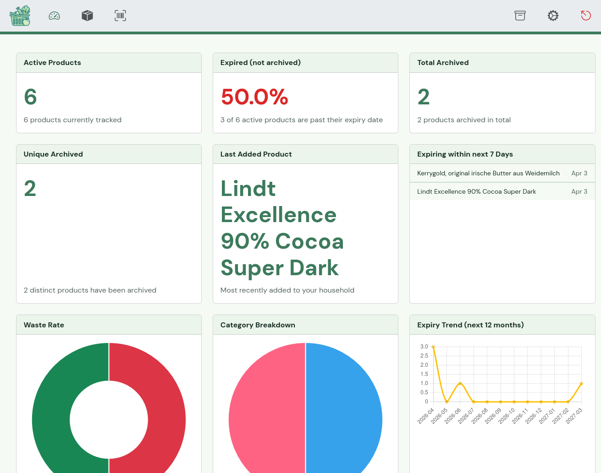
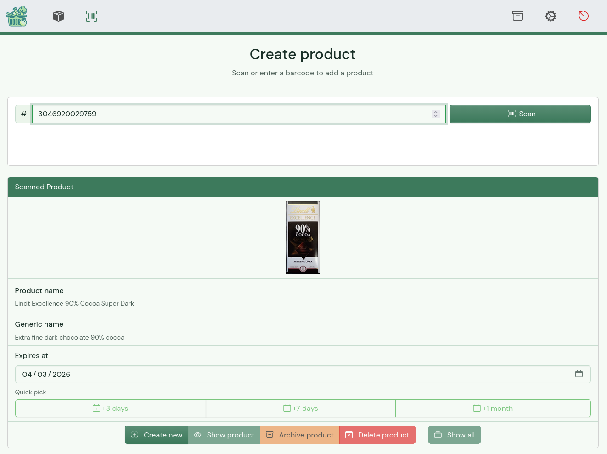
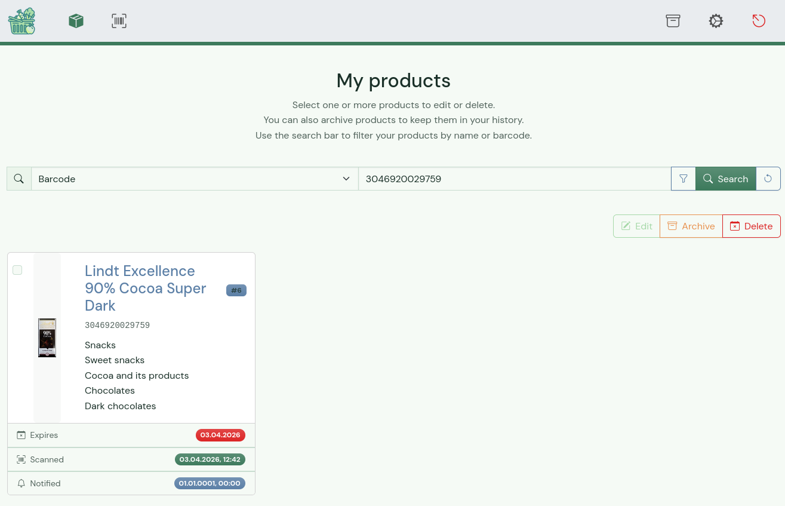

{width=100%}


[](https://sonarcloud.io/summary/new_code?id=Isotop7_proviant)
[](https://sonarcloud.io/summary/new_code?id=Isotop7_proviant)
[](https://sonarcloud.io/summary/new_code?id=Isotop7_proviant)

⁉️ Ever wondered if this oat milk is still fresh or when you opened that hummus? In the past you may have thrown it away. Now there is **proviant**

📚 **proviant** is a simple and intuitive application to track your bought products and their expiration date to prevent waste of food 🥗

## Features

- 📝 Track and log products with expiration dates.
- 📷 Scan product barcodes via camera to auto-fill data from [OpenFoodFacts](https://world.openfoodfacts.org/), with optional local caching for offline use.
- 🗄️ Archive and restore products; bulk delete, archive, and restore.
- 🔍 Search and filter products by multiple parameters.
- ⏰ Receive expiration reminders via email (SMTP) or push notifications ([Ntfy](https://ntfy.sh/)).
- 🔔 Per-user notification preferences.
- 👥 Multi-user support with household scoping.
- 🌙 Dark theme.
- 📊 Dashboard portal with live metric tiles (active products, waste rate, archived counts, last added product, products expiring within 7 days) and charts (waste rate donut, category breakdown pie, 12-month expiry trend line).

## Technologies and Tools

- **Web:** [Go](https://go.dev/), [Gin](https://gin-gonic.com/), [Gorm](https://gorm.io/index.html), [Bootstrap](https://getbootstrap.com/)
- **Charts:** [Chart.js](https://www.chartjs.org/)
- **Database:** MariaDB or SQLite
- **Notifications:** SMTP, [Ntfy](https://ntfy.sh/)

## Installation and Usage

### Backend

#### Executable

1. Clone the repository: `git clone https://codeberg.org/isotop7/proviant.git`
2. Setup node_modules and assets: `make init`
3. Navigate to the project directory: `cd proviant/src`
4. Build the application: `go build -o proviant`
5. Copy the desired config file `config.yaml.[mariadb|sqlite].tmpl`, rename it to `config.yaml` and adjust it
6. Run the server: `./proviant`

#### Docker

`proviant` can be started with `docker compose`

- [External MariaDB database](./docker-compose.mariadb.yaml)
- [Internal SQLite database](./docker-compose.sqlite.yaml)

The app can be configured with environment variables:

```bash
# Server configuration
PROVIANT_SERVER_PORT=5050                                                     # Listening port of server
PROVIANT_SERVER_BASEURL="https://proviant.local.de"                           # URL of Proviant with protocol
PROVIANT_SERVER_AUTHENTICATION_TOKENPASSWORD="secret key"                     # Secret used for JSON Web Tokens
PROVIANT_SERVER_AUTHENTICATION_TOKENLIFETIME=8                                # Lifetime of JSON Web Tokens
PROVIANT_SERVER_CORS_ALLOWALLORIGINS=true                                     # Allow all requests to API
PROVIANT_SERVER_CORS_ALLOWEDORIGINS="http://localhost https://myapi.com"      # Allow this list of hosts to access API

# Database configuration
## SQLite
PROVIANT_ENGINE="sqlite"                                                              # Use sqlite
PROVIANT_SQLITE_FILEPATH="data/proviant.db"                                             # Path to database file, this folder needs to exist
## MariaDB
PROVIANT_ENGINE="mariadb"                                                             # Use mariadb
PROVIANT_MARIADB_DATABASE_HOST="127.0.0.1"                                            # Database server IP or hostname
PROVIANT_MARIADB_DATABASE_PORT=3306                                                   # Database server port
PROVIANT_MARIADB_DATABASE_NAME="proviant"                                               # Database name
PROVIANT_MARIADB_DATABASE_USER="proviant"                                               # Database user
PROVIANT_MARIADB_DATABASE_PASSWORD="password"                                         # Database user password

# Logging configuration
PROVIANT_LOGGING_ENABLED=true                                                 # Enable file logging
PROVIANT_LOGGING_FILE="proviant.log"                                            # Path to log file

# Notification configuration
PROVIANT_NOTIFICATION_ENABLED=true                          # Enable notifications
PROVIANT_NOTIFICATION_INTERVAL=12                           # Interval in hours when notifications should be send
PROVIANT_NOTIFICATION_SMTP_FROMADDRESS="sender@local.net"   # Sender address for notifications
PROVIANT_NOTIFICATION_SMTP_HOST="127.0.0.1"                 # Host or IP address of SMTP server
PROVIANT_NOTIFICATION_SMTP_PORT=25                          # Port of SMTP server
PROVIANT_NOTIFICATION_SMTP_SSL=false                        # Enables/disables SSL
PROVIANT_NOTIFICATION_SMTP_USER="user"                      # Username used for sending notifications via SMTP server
PROVIANT_NOTIFICATION_SMTP_PASSWORD="password"              # Password used for sending notifications via SMTP server
PROVIANT_NOTIFICATION_NTFY_URL="https://ntfy.sh"            # Default Ntfy URL
PROVIANT_NOTIFICATION_NTFY_TOPIC="default_topic"            # Default Ntfy topic
PROVIANT_NOTIFICATION_NTFY_TIMEOUT=60                       # Ntfy message timeout

# OpenFoodFacts configuration
PROVIANT_OPENFOODFACTS_URL="https://world.openfoodfacts.org/api/v2/product"   # Address of API backend of OpenFoodFacts
PROVIANT_OPENFOODFACTS_TIMEOUT=5                                              # Timeout of API requests to OpenFoodFacts API
PROVIANT_OPENFOODFACTS_CACHEENABLED=true                                      # Cache OpenFoodFacts responses in the database for offline use
```

Additionally `Gin` supports a debug mode, which also can be set with a environment variable:

```bash
GIN_MODE=debug
```

## Changelog

User-facing important changes are documented in the [CHANGELOG.md](./CHANGELOG.md) file.

## What's missing?

- Administrative Functions: Create and Update users

## Documentation

Documentation is generated with `gomarkdoc` and `swagger`:

- [Package documentation](./docs/README.md)
- [Swagger definition](./docs/swagger.yaml)

## Screenshots

- Login and Signup page for multi user mode


- Portal view with activity tiles



- Create product and query data from OpenFoodFactAPI



- Search all products based on parameters



## Contributing

Contributions are welcome! Fork the repository, make your changes, and submit a pull request.

## License

This project is licensed under the [MIT License](LICENSE).

## Author

- Codeberg: [@Isotop7](https://codeberg.org/isotop7)
- LinkedIn: [Hendrik Röder](https://www.linkedin.com/in/hendrik-r%C3%B6der-9b8483198/)

---
