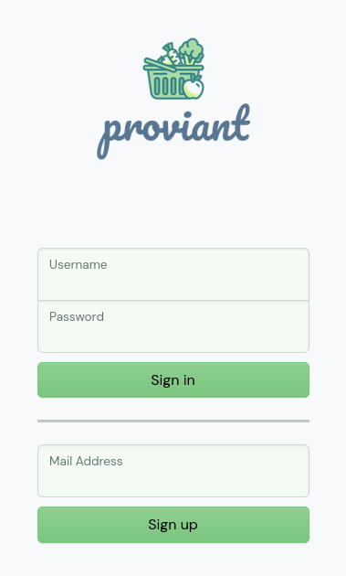
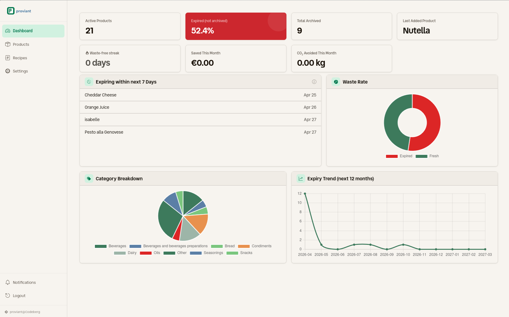
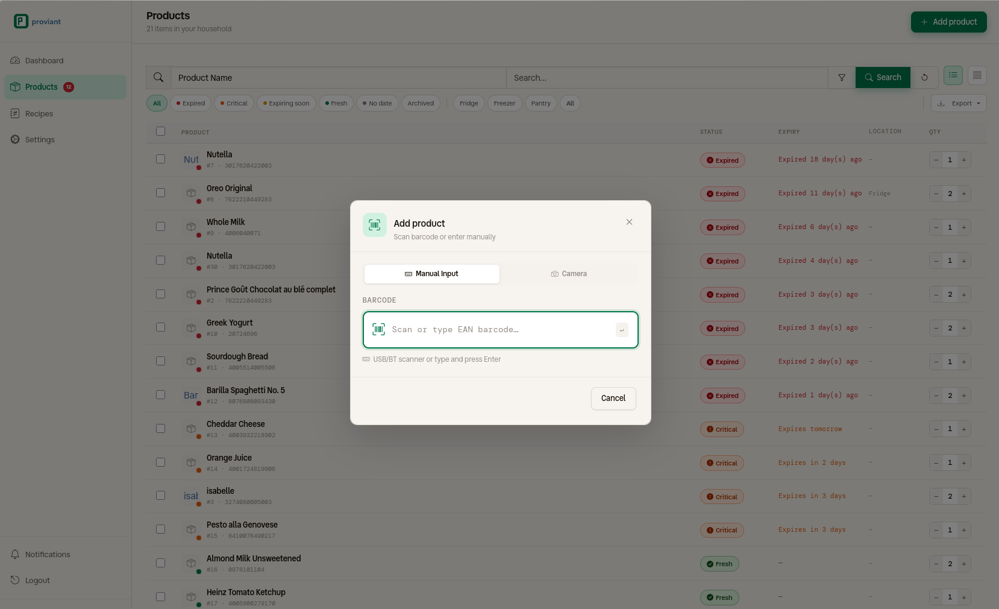

{width=100%}


[](https://sonarcloud.io/summary/new_code?id=Isotop7_proviant)
[](https://sonarcloud.io/summary/new_code?id=Isotop7_proviant)
[](https://sonarcloud.io/summary/new_code?id=Isotop7_proviant)

⁉️ Ever wondered if this oat milk is still fresh or when you opened that hummus? In the past you may have thrown it away. Now there is **proviant**

📚 **proviant** is a simple and intuitive application to track your bought products and their expiration date to prevent waste of food 🥗

## Features

- 📝 Track and log products with expiration dates.
- 📷 Scan product barcodes via camera to auto-fill data from [OpenFoodFacts](https://world.openfoodfacts.org/), with optional local caching for offline use.
- 🗄️ Archive and restore products; bulk delete, archive, and restore.
- 🔍 Search and filter products by multiple parameters.
- ⏰ Receive expiration reminders via email (SMTP), push notifications ([Ntfy](https://ntfy.sh/)), or [Telegram](https://telegram.org/) bot.
- 🔔 Per-user notification preferences.
- 👥 Multi-user support with household scoping.
- 🌙 Dark theme.
- 📊 Dashboard portal with live metric tiles (active products, waste rate, archived counts, last added product, products expiring within 7 days) and charts (waste rate donut, category breakdown pie, 12-month expiry trend line).

## Technologies and Tools

- **Web:** [Go](https://go.dev/), [Gin](https://gin-gonic.com/), [Gorm](https://gorm.io/index.html), [Bootstrap](https://getbootstrap.com/)
- **Charts:** [Chart.js](https://www.chartjs.org/)
- **Database:** MariaDB or SQLite
- **Notifications:** SMTP, [Ntfy](https://ntfy.sh/), [Telegram](https://telegram.org/)

## Installation and Usage

### Backend

#### Executable

1. Clone the repository: `git clone https://codeberg.org/isotop7/proviant.git`
2. Setup node_modules and assets: `task init`
3. Navigate to the project directory: `cd proviant/src`
4. Build the application: `go build -o proviant`
5. Copy the desired config file `config.yaml.[mariadb|sqlite].tmpl`, rename it to `config.yaml` and adjust it
6. Run the server: `./proviant`

#### Docker

`proviant` can be started with `docker compose`

- [External MariaDB database](./docker-compose.mariadb.yaml)
- [Internal SQLite database](./docker-compose.sqlite.yaml)

The app can be configured with environment variables:

```bash
# Server configuration
PROVIANT_SERVER_PORT=5050                                                      # Listening port of server
PROVIANT_SERVER_BASEURL="https://proviant.local.de"                           # URL of Proviant with protocol
PROVIANT_SERVER_AUTHENTICATION_TOKENPASSWORD="secret key"                       # Secret used for JSON Web Tokens
PROVIANT_SERVER_AUTHENTICATION_TOKENLIFETIME=8                                # Lifetime of JSON Web Tokens in hours
PROVIANT_SERVER_AUTHENTICATION_MAXLOGINATTEMPTS=3                             # Maximum failed login attempts before lockout
PROVIANT_SERVER_AUTHENTICATION_LOCKOUTDURATIONMINS=10                        # Lockout duration in minutes after max failed attempts
PROVIANT_SERVER_AUTHENTICATION_PASSWORDMINLENGTH=12                           # Minimum password length
PROVIANT_SERVER_AUTHENTICATION_PASSWORDREQUIREUPPERCASE=false                 # Require at least one uppercase letter
PROVIANT_SERVER_AUTHENTICATION_PASSWORDREQUIREDIGIT=false                     # Require at least one digit
PROVIANT_SERVER_AUTHENTICATION_PASSWORDREQUIRESPECIAL=false                   # Require at least one special character
PROVIANT_SERVER_AUTHENTICATION_PASSWORDCHECKBREACHED=true                      # Check passwords against HaveIBeenPwned API
PROVIANT_SERVER_CORS_ALLOWALLORIGINS=true                                     # Allow all origins (true) or use allowedOrigins list (false)
PROVIANT_SERVER_CORS_ALLOWEDORIGINS="http://localhost https://myapi.com"      # List of allowed origins when allowAllOrigins is false
PROVIANT_SERVER_SECURITYHEADERS_CONTENT_SECURITY_POLICY="default-src 'self'"   # Content Security Policy header

# Database configuration
## SQLite
PROVIANT_DATABASE_ENGINE="sqlite"                                            # Database engine (sqlite or mariadb)
PROVIANT_DATABASE_SQLITE_FILEPATH="data/proviant.db"                         # Path to SQLite database file (folder must exist)
## MariaDB
PROVIANT_DATABASE_ENGINE="mariadb"                                          # Database engine (sqlite or mariadb)
PROVIANT_DATABASE_MARIADB_HOST="127.0.0.1"                                  # MariaDB server IP or hostname
PROVIANT_DATABASE_MARIADB_PORT=3306                                          # MariaDB server port
PROVIANT_DATABASE_MARIADB_NAME="proviant"                                    # Database name
PROVIANT_DATABASE_MARIADB_USER="proviant"                                    # Database user
PROVIANT_DATABASE_MARIADB_PASSWORD="password"                                # Database user password

# Logging configuration
PROVIANT_LOGGING_ENABLED=true                                                # Enable file logging
PROVIANT_LOGGING_FILE="proviant.log"                                         # Path to log file

# Notification configuration
PROVIANT_NOTIFICATION_ENABLED=true                                            # Enable notifications
PROVIANT_NOTIFICATION_INTERVAL=12                                            # Interval in hours when notifications should be sent
PROVIANT_NOTIFICATION_SMTP_HOST="127.0.0.1"                                  # SMTP server host or IP address
PROVIANT_NOTIFICATION_SMTP_PORT=25                                           # SMTP server port
PROVIANT_NOTIFICATION_SMTP_SSL=false                                         # Enable/disable SSL for SMTP
PROVIANT_NOTIFICATION_SMTP_USER="user"                                       # SMTP username
PROVIANT_NOTIFICATION_SMTP_PASSWORD="password"                                # SMTP password
PROVIANT_NOTIFICATION_SMTP_FROMADDRESS="sender@local.net"                     # Sender email address for notifications
PROVIANT_NOTIFICATION_NTFY_URL="https://ntfy.sh"                             # Ntfy server URL
PROVIANT_NOTIFICATION_NTFY_TOPIC="default_topic"                             # Default Ntfy topic/channel
PROVIANT_NOTIFICATION_NTFY_TIMEOUT=60                                         # Ntfy message timeout in seconds
PROVIANT_NOTIFICATION_TELEGRAM_BOTTOKEN="1234567890:ABCDefGHIjklMNOpqrSTUvwxYZ"  # Telegram bot token from BotFather
PROVIANT_NOTIFICATION_TELEGRAM_BOTUSERNAME="MyProviantBot"                   # Bot username (optional, auto-resolved via getMe)
PROVIANT_NOTIFICATION_TELEGRAM_TIMEOUT=10                                    # Telegram API request timeout in seconds

# OpenFoodFacts configuration
PROVIANT_OPENFOODFACTS_URL="https://world.openfoodfacts.org/api/v2/product"  # OpenFoodFacts API URL
PROVIANT_OPENFOODFACTS_TIMEOUT=5                                             # API request timeout in seconds
PROVIANT_OPENFOODFACTS_CACHEENABLED=true                                     # Cache API responses in database for offline use
```

### Telegram Notifications

To receive notifications via Telegram:

1. **Create a bot** — open Telegram, message [@BotFather](https://t.me/BotFather), run `/newbot`, and follow the prompts. Copy the bot token you receive.
2. **Configure proviant** — set the bot token in `config.yaml` or via the `PROVIANT_NOTIFICATION_TELEGRAM_BOTTOKEN` environment variable:
   ```yaml
   notification:
     telegram:
       botToken: "1234567890:ABCDefGHIjklMNOpqrSTUvwxYZ"
       timeout: 10
   ```
3. **Start proviant** — the server will automatically resolve the bot username from Telegram on startup.
4. **Link your account** — go to **User Settings → Notification Settings → Telegram**, click **Link Account**, then **Generate Token**. Click **Open in Telegram** and press **Start** in the bot chat.
5. **Enable** — toggle Telegram notifications on in User Settings and save.

> **Note:** The bot uses long-polling to receive messages. No public URL or webhook configuration is required.

Additionally `Gin` supports a debug mode, which also can be set with a environment variable:

```bash
GIN_MODE=debug
```

## Changelog

User-facing important changes are documented in the [CHANGELOG.md](./CHANGELOG.md) file.

## What's missing?

- Administrative Functions: Create and Update users

## Documentation

Documentation is generated with `gomarkdoc` and `swagger`:

- [Package documentation](./src/docs/README.md)
- [Swagger definition](./src/docs/swagger.yaml)

## Screenshots

- Login and Signup page for multi user mode



- Portal view with activity tiles



- Create product and query data from OpenFoodFactAPI



- Search all products based on parameters


## Contributing

Contributions are welcome! Fork the repository, make your changes, and submit a pull request.

## License

This project is licensed under the [MIT License](LICENSE).

## Author

- Codeberg: [@Isotop7](https://codeberg.org/isotop7)
- LinkedIn: [Hendrik Röder](https://www.linkedin.com/in/hendrik-r%C3%B6der-9b8483198/)

---
